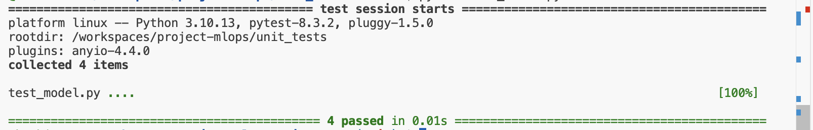
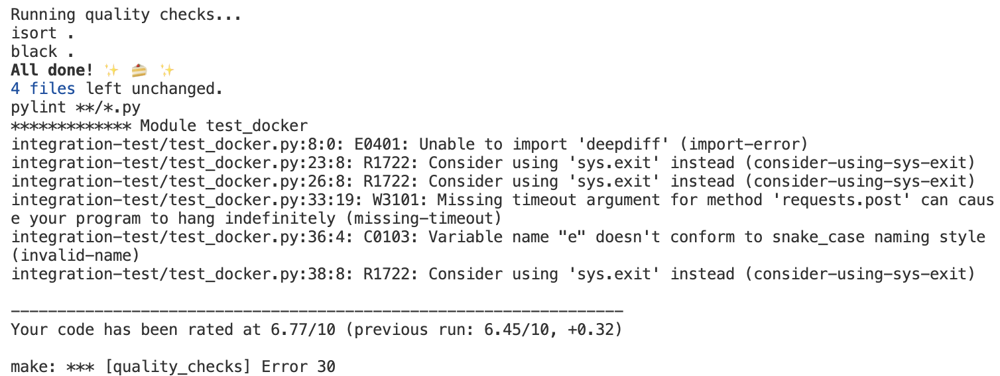

# Bike Sharing Demand Prediction

## Project Description
This is the implementation of my project for the course mlops-zoomcamp from [DataTalksClub](https://github.com/DataTalksClub/mlops-zoomcamp).
The goal of this project is to build an end-to-end machine learning pipeline to predict bike-sharing demand using historical data. This prediction will help optimize bike distribution and availability in a bike-sharing system. The main focus of the project is on creating a production service with experiment tracking, pipeline automation, and observability.

## Problem Statement
Bike-sharing systems are becoming increasingly popular in urban areas as a convenient and eco-friendly mode of transportation. However, managing the distribution of bikes to meet demand is challenging. The objective of this project is to predict the number of bikes required at different stations at different times of the day to ensure optimal availability and customer satisfaction.
By addressing these challenges through data analysis, the project aims to enhance the overall user experience, increase operational efficiency, and promote sustainable urban transportation.

## Dataset
The dataset used for this project is the "Bike Sharing Demand" dataset, which includes historical data on bike rentals, weather conditions, and timestamps. This dataset is available on [UCI](https://archive.ics.uci.edu/dataset/275/bike+sharing+dataset) Machine Learning Repository.

## Project details
This repository has five folders: *data*, *notebooks*, *models*, *src*, and *web_service*.
- The [`data`](https://github.com/kachiann/project-mlops/tree/main/data) folder contains the dataset for the project.
- The [`notebooks`](https://github.com/kachiann/project-mlops/tree/main/notebook) folder contains Jupyter notebooks used for exploratory data analysis (EDA), and initial model experimentation.
- The [`models`](https://github.com/kachiann/project-mlops/tree/main/models) folder stores the trained machine learning models and any related artifacts.
- The [`src`](https://github.com/kachiann/project-mlops/tree/main/src) folder contains the source codes for the project.
- The [`web_service`](https://github.com/kachiann/project-mlops/tree/main/web_service) folder contains the source codes for the model deployment.
- The [`monitoring`](https://github.com/kachiann/project-mlops/tree/main/monitoring) folder

## Additional files
- **requirements.txt**
  - Lists all the Python dependencies required for the project.
- **Dockerfile**
  - Defines the Docker image for the project, specifying the environment and dependencies required to run the code.
- **deployment.yaml**
    - Defines the [Kubernetes](https://kubernetes.io/) deployment and service for the project.
      
## Clouds 
- The project is deployed to Kubernetes and Docker. 
---
## Quick Start

To get started with this project, follow these steps in your terminal:

1. **Clone the Repository:**

   Begin by cloning the project repository from GitHub:

   ```bash
   git clone https://github.com/kachiann/project-mlops.git
   ```

2. **Navigate to the Project Directory:**

   Change your directory to the newly cloned project folder:

   ```bash
   cd project-mlops
   ```

3. **Set Up the Environment:**

   Ensure you have a Python environment set up. You can create a virtual environment using:

   ```bash
   python3.11 -m venv venv
   source venv/bin/activate  # On Windows use `venv\Scripts\activate`
   ```

4. **Install Dependencies:**

   Install the necessary Python packages:

   ```bash
   pip install -r requirements.txt
   ```
5. **Run Implementation Files**:
   
Ensure that you are still in the activated virtual environment when running the files. This ensures that all dependencies are correctly referenced.


## Implementation Details

### 1. Experiment Tracking and Model Registry:

- **Experiment Tracking with MLflow:**

  Use **[MLflow](https://mlflow.org/)** to track experiments, metrics, and artifacts. Start the MLflow server with a remote backend:

  ```bash
  mlflow server --backend-store-uri sqlite:///backend.db
  ```
  Or 

  Start the MLflow server with a remote backend and specify the default artifact root

  ```bash
  mlflow server --backend-store-uri sqlite:///backend.db --default-artifact-root ./mlruns
  ```
  Once the server is running, you can access the MLflow UI by navigating to the following URL in your web browser:

  [http://127.0.0.1:5000](http://127.0.0.1:5000)

  This web interface allows you to visualize your experiments, compare model metrics, and manage your model registry.
  
- **Model Development:**

  Develop Linear Regression and Decision Tree Regressor models using scikit-learn on the bike-sharing dataset. Use the following command to execute the experiment tracking script:

  ```bash
  python src/experiment_tracking.py
  ```

- **Model Comparison and Registration:**

  Compare model performance by examining metrics such as MAE and R2. Register the models in the MLflow Model Registry. To manage the model registry, use:

  ```bash
  python src/model_registry.py
  ```
- **Model Loading:**

  Implement functionality to load models from the saved pickle files for further use or deployment.


---

### 2. Workflow Orchestration (Fully deployed):

**[Prefect](https://www.prefect.io/)** is used to create and manage the entire ML pipeline. It is a powerful and open-source workflow orchestration tool that lets users design, monitor, and respond to data and machine learning pipelines using Python code. The `ml_pipeline.py` includes data ingestion, preprocessing, model training, evaluation, and deployment steps.

**Prefect Task**:

A Prefect Task is a Python function decorated with the `@task` decorator that represents discrete units of work within a Prefect workflow. `ml_pipeline.py` represents a machine learning pipeline that integrates MLflow for experiment tracking and Prefect for workflow management.

**Task Customization:** You can customize the task decorator with optional arguments like `name`, `description`, `tags`, `cache settings`, `retries`, and more.

**Prefect Flow**

The `ml_pipeline()` function, decorated with `@flow`, orchestrates the entire workflow:

- **Sets up MLflow tracking URI and experiment name**
- **Executes each task in sequence**
- **Passes data between tasks**


**Prefect Deployments**

Deployments are flows stored on the local server or on the cloud and include important information for orchestrating your workflow remotely, such as scheduling and execution details. Using Prefect offers several advantages:

- Monitoring the pipeline
- Scheduling with CRON
- Automatic retries on failure
- Logging and observability
- Notifications
- Automated workflows requiring no human intervention

### Usage Instructions

**Note:** Ensure that you are operating within the activated virtual environment (`venv`) throughout this process. If you haven’t activated your virtual environment yet, do so with the following command:

```bash
source venv/bin/activate  # On Windows use `venv\Scripts\activate`
```

#### 1. Log in to Prefect Cloud

Before running the `ml_pipeline.py` file, log in to Prefect Cloud using the following command:

```bash
prefect cloud login
```

Follow the prompts to enter your Prefect Cloud API key and complete the login process.

#### 2. Install Dependencies

Ensure all necessary dependencies are installed by running:

```bash
pip install -r requirements.txt
```

#### 3. Test the Prefect Flow

Run the Python file in the terminal to test the Prefect Flow:

```bash
python src/ml_pipeline.py
```

#### 4. Build and Deploy the Prefect Deployment Locally

To run the deployment locally, build the "Deployment" by providing the file and flow function names:

```bash
prefect deployment build src/ml_pipeline.py:ml_pipeline -n 'ml_pipeline_bike_sharing_analysis' -a --tag dev
```

#### 5. Start Prefect Agents

Initialize the Prefect agents in a new terminal with the default work pool name:

```bash
prefect agent start -p 'default-agent-pool'
```

#### 6. Run the Deployment

In a new terminal, execute the deployment:

```bash
prefect deployment run 'ml-pipeline/ml_pipeline_bike_sharing_analysis'
```

#### 7. Use the Prefect UI

To run and monitor your workflows using the Prefect UI:

1. Start the Prefect server:

   ```bash
   prefect server start
   ```

2. Access the Prefect Dashboard by navigating to the following URL in your web browser:

   [http://127.0.0.1:4200](http://127.0.0.1:4200)

3. In the Deployment section of the Prefect UI, you can view the current Deployment along with its activity and tags.


---

### 3. Model Deployment:

To deploy the trained machine learning models as a web service, we utilize Flask along with MLflow. The deployment script, `deploy.py`, is responsible for loading the model and serving predictions through a RESTful API.

For detailed usage instructions, please refer to the [**web_service**](https://github.com/kachiann/project-mlops/tree/main/web_service) folder in this repository.

**Key Steps for Model Deployment**:

1. **Launch the MLflow Server**: Before running the deployment script, start the MLflow server locally by executing the following command:
```bash
mlflow server --backend-store-uri sqlite:///backend.db
```

2. **Run the Deployment Script**: Execute the `deploy.py` file to start the Flask API:
```bash
python web_service/deploy.py
```

3. **Model Loading and Prediction Logic**: The script automatically loads the latest production version of the registered model from MLflow for making predictions based on incoming requests.

4. **Requirements**: The `requirements.txt` file lists the necessary dependencies for running the deployment script.

5. **Containerization**: To deploy the application in a Docker container, a `Dockerfile`.

6. **Testing the API**: Instructions for testing the deployed API are available in the `web_service` folder.

7. **Kubernetes Deployment**: If intrested in deploying the Flask application on Kubernetes, a `deployment.yaml` file is provided in the `web_service` folder.

By following the instructions in the **web_service** folder, you can successfully deploy the bike-sharing demand prediction model as a web service using Flask and MLflow, allowing users to make predictions via API calls.

---

### 4. Model Monitoring:

[**Evidently AI**](https://www.evidentlyai.com/) is an open-source Python library for monitoring ML models during development, validation, and in production. It checks data and model quality, data drift, target drift, and regression and classification performance. We will integrate Evidently AI into the project to enhance our data and model monitoring capabilities. You can find the Evidently notebook in the `notebooks` folder.

**Usage**:

1. **Navigate to the Monitoring Folder:**

   Change your directory to the `monitoring` folder:

   ```bash
   cd monitoring
   ```

2. **Run Docker Compose:**

   Start the Evidently monitoring environment using Docker:

   ```bash
   docker compose up --build
   ```

3. **Start the MLflow UI:**

   In a new terminal window, load the MLflow UI to track your experiments:

   ```bash
   mlflow server --backend-store-uri sqlite:///backend.db
   ```

4. **View Baseline Model Metrics:**

   To view the baseline model metrics via the Evidently UI, you can run the Jupyter notebook `baseline_model_evidently.ipynb` located in the `notebooks` folder. Make sure to open the relevant notebook and execute the cells to generate the necessary visualizations.

5. **Run the Evidently UI:**

   Execute the following command in the terminal to start the Evidently UI:

   ```bash
   evidently ui
   ```

This setup allows you to monitor your machine learning models effectively, providing insights into data quality, model performance, and any potential drifts in your data. By integrating Evidently AI, you can ensure that your models remain robust and reliable in production.


---

5. ### Best Practices:
   #### To-Do List
- [x] Reproducibility
      
The versions for all dependencies are specified.
      
- [x] Unit Tests

- [x] Integration test

See [**tests**](https://github.com/kachiann/project-mlops/tree/main/tests) folder.
      
- [x] Linter and/or formatter


---


---

Added docstrings, improved variable naming, and addressed Pylint issues


- [x] Makefile



- [ ] pre-commit hooks
- [x] CI/CD pipeline

6. ### Services
- MLFlow - [http://127.0.0.1:5000](http://127.0.0.1:5000)
- Flask app - [http://127.0.0.1:8080](http://127.0.0.1:8080)
- Prefect - Dashboard: http://127.0.0.1:4200](http://127.0.0.1:4200)
