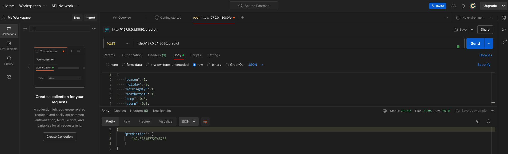

# Bike Sharing Demand Prediction

## Project Description
This is the implementation of my project for the course mlops-zoomcamp from [DataTalksClub](https://github.com/DataTalksClub/mlops-zoomcamp).
The goal of this project is to build an end-to-end machine learning pipeline to predict bike-sharing demand using historical data. This prediction will help optimize bike distribution and availability in a bike-sharing system. The main focus of the project is on creating a production service with experiment tracking, pipeline automation, and observability.

## Problem Statement
Bike-sharing systems are becoming increasingly popular in urban areas as a convenient and eco-friendly mode of transportation. However, managing the distribution of bikes to meet demand is challenging. The objective of this project is to predict the number of bikes required at different stations at different times of the day to ensure optimal availability and customer satisfaction.
By addressing these challenges through data analysis, the project aims to enhance the overall user experience, increase operational efficiency, and promote sustainable urban transportation.

## Dataset
The dataset used for this project is the "Bike Sharing Demand" dataset, which includes historical data on bike rentals, weather conditions, and timestamps. This dataset is available on [UCI](https://archive.ics.uci.edu/dataset/275/bike+sharing+dataset) Machine Learning Repository.

## Project details
This repository has four folders: *data*, *notebooks*, *models*, and *src*.
- The `data` folder contains the dataset for the project.
- The `notebooks` folder contains Jupyter notebooks used for exploratory data analysis (EDA), and initial model experimentation.
- The `models` folder stores the trained machine learning models and any related artifacts.
- The `src` folder contains the source codes for the project.

## Additional files
- **requirements.txt**
  - Lists all the Python dependencies required for the project.
- **Dockerfile**
  - Defines the Docker image for the project, specifying the environment and dependencies required to run the code.
- **deployment.yaml**
    - Defines the [Kubernetes](https://kubernetes.io/) deployment and service for the project.

---

## Implementation Details

**1. Experiment Tracking and Model Registry**:
- Used **[MLflow](https://mlflow.org/)** for tracking experiments, metrics, and artifacts with a remote server.
- Developed Linear Regression and Decision Tree Regressor using scikit-learn on the bike-sharing dataset.
- Created a function to train models, log parameters, metrics (MAE, R2), and save models as artifacts and pickle files.
```bash
mlflow server --backend-store-uri sqlite:///backend.db
```
```bash
python src/experiment_tracking.py
```
- Compared model performance and registered models in the MLflow Model Registry.
- Implemented functionality to load models from pickle files.
```bash
python src/model_registry.py
```


---

**2. Workflow Orchestration** (Fully deployed):

**[Prefect](https://www.prefect.io/)** is used to create and manage the entire ML pipeline. It is a powerful and open-source workflow orchestration tool that lets users design, monitor, and respond to data and machine learning pipelines using Python code. The `ml_pipeline.py` includes data ingestion, preprocessing, model training, evaluation, and deployment steps.

**Prefect Task**:

A Prefect Task is a Python function decorated with the `@task` decorator that represents discrete units of work within a Prefect workflow. `ml_pipeline.py` represents a machine learning pipeline that integrates MLflow for experiment tracking and Prefect for workflow management.

We can also customize the task decorator with optional arguments like name, description, tags, cache settings, retries, and more.

The `ml_pipeline()` function, decorated with @flow, orchestrates the entire workflow:
- Sets up MLflow tracking URI and experiment name
- Executes each task in sequence
- Passes data between tasks

**Prefect Deployments**

Deployments are flows stored on the local server or on the cloud and include important information for orchestrating your workflow remotely, such as scheduling and execution details. Using Prefect offers several advantages:

- Monitoring the pipeline
- Scheduling with CRON
- Automatic retries on failure
- Logging and observability
- Notifications
- Automated workflows requiring no human intervention
  
**Usage**: To test the Prefect Flow, run the Python file in the terminal.
```bash
pip install -r requirements.txt
```

```bash
python src/ml_pipeline.py
```
To run the deployment locally, we must build the “Deployment” by providing the file and flow function names.
```bash
prefect deployment build src/ml_pipeline.py:ml_pipeline -n 'ml_pipeline_bike_sharing_analysis' -a --tag dev
```
We will initialize the Prefect agents in a new terminal with the default work pool name.
```bash
prefect agent start -p 'default-agent-pool'
```
Go to a new terminal and run the deployment
```bash
prefect deployment run 'ml-pipeline/ml_pipeline_bike_sharing_analysis'
```

To run using **Prefect UI**
```bash
prefect server start
```
In the Deployment section in the Prefect UI, you can view the current Deployment along with its activity and tags. See below.


---

**3. Model Deployment**:
In this project, we containerized the MLflow model using Docker and deployed it on a Kubernetes cluster. [**Kubernetes**](https://kubernetes.io/) is essential for machine learning model training and deployment, offering automated management and scaling of containerized applications

The deployment includes:
- **Dockerization**: This involves packaging the MLflow model and its dependencies into a container, ensuring consistent execution across different environments. We created a Docker image for the MLflow model server, encapsulating the server and all its dependencies into a single, portable image. See `Dockerfile`.

- **Kubernetes Deployment**: Deployed the model as a Kubernetes deployment with three replicas and exposed it via a service. This configuration defines how the application runs in the Kubernetes cluster, leveraging features such as automated rollouts and rollbacks, and self-healing capabilities. See `deployment.yaml`.

- **Environment Configuration**: Set the `MLFLOW_TRACKING_URI` to connect to the MLflow server, ensuring proper model tracking and versioning. The configuration is handled in `deploy.py` in the web service folder, which sets up the environment and waits for the MLflow server to be available before loading the model.
- **Local Access**: Used port forwarding to expose the prediction endpoint, allowing for local testing and development.

- **Scalability**: Kubernetes allows for easy horizontal scaling of the application, either manually or automatically based on CPU usage.


**Usage**: 

1. **Start Port Forwarding**:
   ```bash
   kubectl port-forward service/mlflow-model-service 5000:80
   ```

2. **Send a Prediction Request**:
   Use the `test_predict.py` script to send a POST request:

   Run the script:
   ```bash
   python src/test_predict.py
   ```

This setup allows for real-time inference, providing immediate predictions on demand.



**4. Model Monitoring**:

[**Evidently AI**](https://www.evidentlyai.com/) is an open-source Python library for monitoring ML models during development, validation, and in production. It checks data and model quality, data drift, target drift, and regression and classification performance. We will integrate Evidently AI into the project to enhance data and model monitoring capabilities.

**Usage**:
1. Install Evidently AI library
   ```bash
   pip install evidently
   ```
2. Run the script
   ```bash
   python src/evidently_model_analysis.py
   ```
3. Open the generated HTML reports

---

5. **Best Practices**: