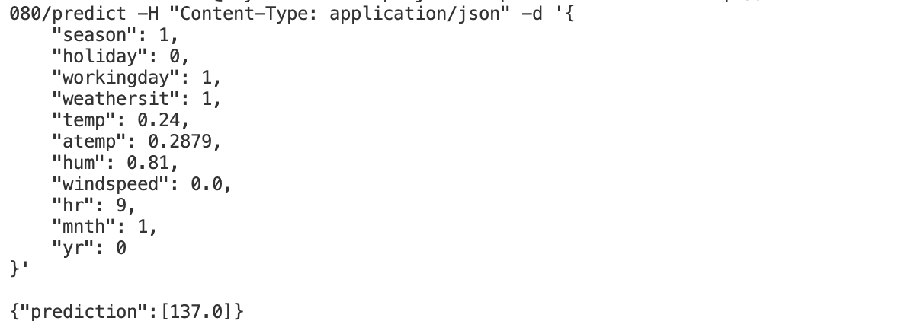

### **3. Model Deployment**:

In this project, we containerized the MLflow model using Docker and deployed it on a Kubernetes cluster. [**Kubernetes**](https://kubernetes.io/) is essential for machine learning model training and deployment, offering automated management and scaling of containerized applications.

#### The deployment includes:

- **Dockerization**: 
  - This involves packaging the MLflow model and its dependencies into a container, ensuring consistent execution across different environments.
  - We created a Docker image for the MLflow model server, encapsulating the server and all its dependencies into a single, portable image. See `Dockerfile`.

- **Kubernetes Deployment**: 
  - We deployed the model as a Kubernetes deployment with three replicas and exposed it via a service. 
  - This configuration defines how the application runs in the Kubernetes cluster, leveraging features such as automated rollouts, rollbacks, and self-healing capabilities. See `deployment.yaml`.

- **Environment Configuration**: 
  - The `MLFLOW_TRACKING_URI` is set to connect to the MLflow server, ensuring proper model tracking and versioning. 
  - The configuration is handled in `deploy.py` in the `web_service` folder, which sets up the environment and waits for the MLflow server to be available before loading the model.

- **Local Access**: 
  - We used port forwarding to expose the prediction endpoint, allowing for local testing and development. 
  - The **Flask** application defined in `deploy.py` serves as the interface for making predictions.

- **Scalability**: 
  - Kubernetes allows for easy horizontal scaling of the application, either manually or automatically based on CPU usage.

### **Usage**:

#### 1. Build Docker Image:

```bash
docker build -t bike-sharing .
```

Once the image is built, you can run it with:

```bash
docker run -p 8080:8080 bike-sharing
```

#### 2. Start Flask Application:

In a different terminal, you can start your Flask app by running:

```bash
python web_service/deploy.py
```

#### 3. Test the /predict Endpoint:

Using `curl` to test the `/predict` endpoint, you need to make a POST request with a JSON payload.

```bash
curl -X POST http://localhost:8080/predict -H "Content-Type: application/json" -d '{
    "season": 1,
    "holiday": 0,
    "workingday": 1,
    "weathersit": 1,
    "temp": 0.24,
    "atemp": 0.2879,
    "hum": 0.81,
    "windspeed": 0.0,
    "hr": 9,
    "mnth": 1,
    "yr": 0
}'
```


Or using Postman:
- Open Postman and create a new request.
- Set the request type to POST.
- Enter the URL: `http://localhost:8080/predict`.
- Go to the Body tab and select `raw`.
- Choose JSON from the dropdown.
- Enter the JSON data in the text area.

#### 4. Start Kubernetes Cluster:

```bash
minikube start
```

#### 5. Start Port Forwarding:

```bash
kubectl port-forward service/mlflow-model-service 5000:80
```

#### 6. Send a Prediction Request:

Use the `test_predict.py` script to send a POST request. Run the script:

```bash
python web_service/test_predict.py
```

This setup allows for real-time inference, providing immediate predictions on demand.

